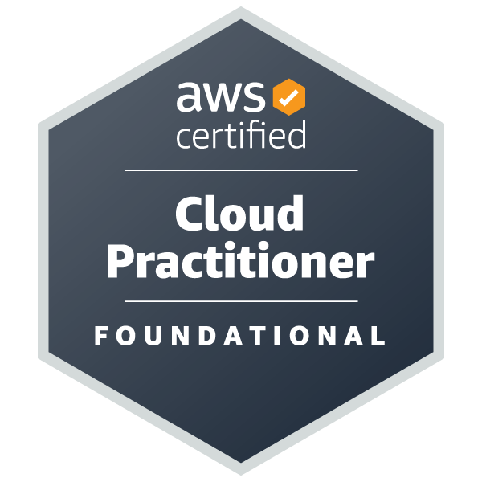
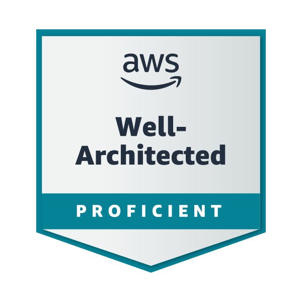
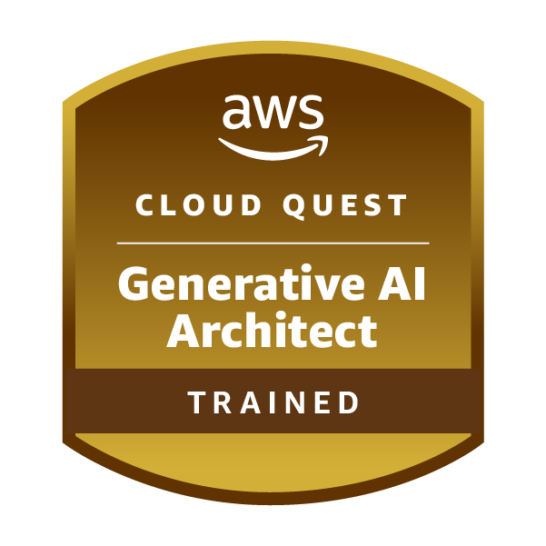
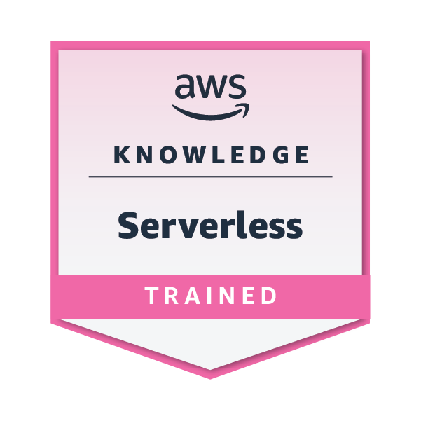
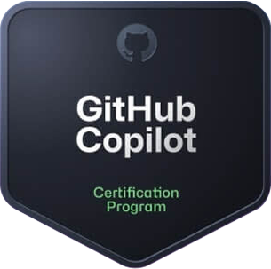
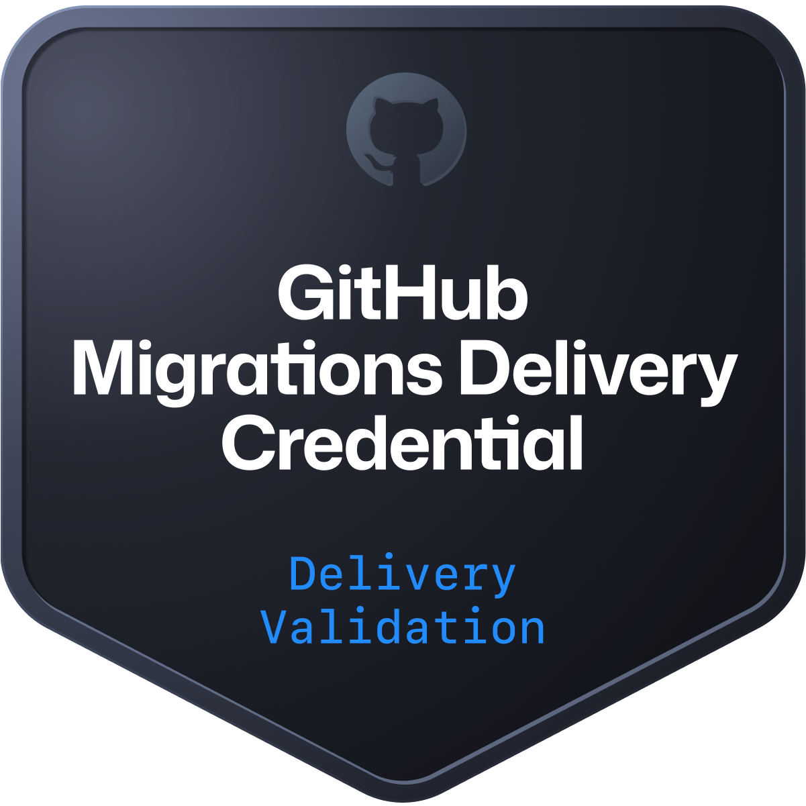
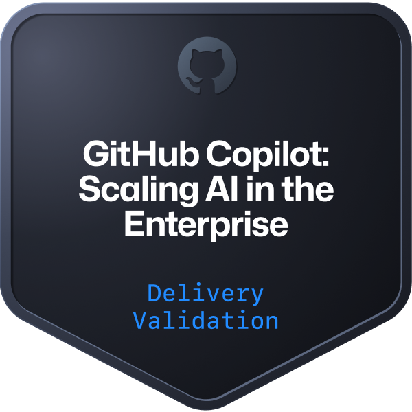
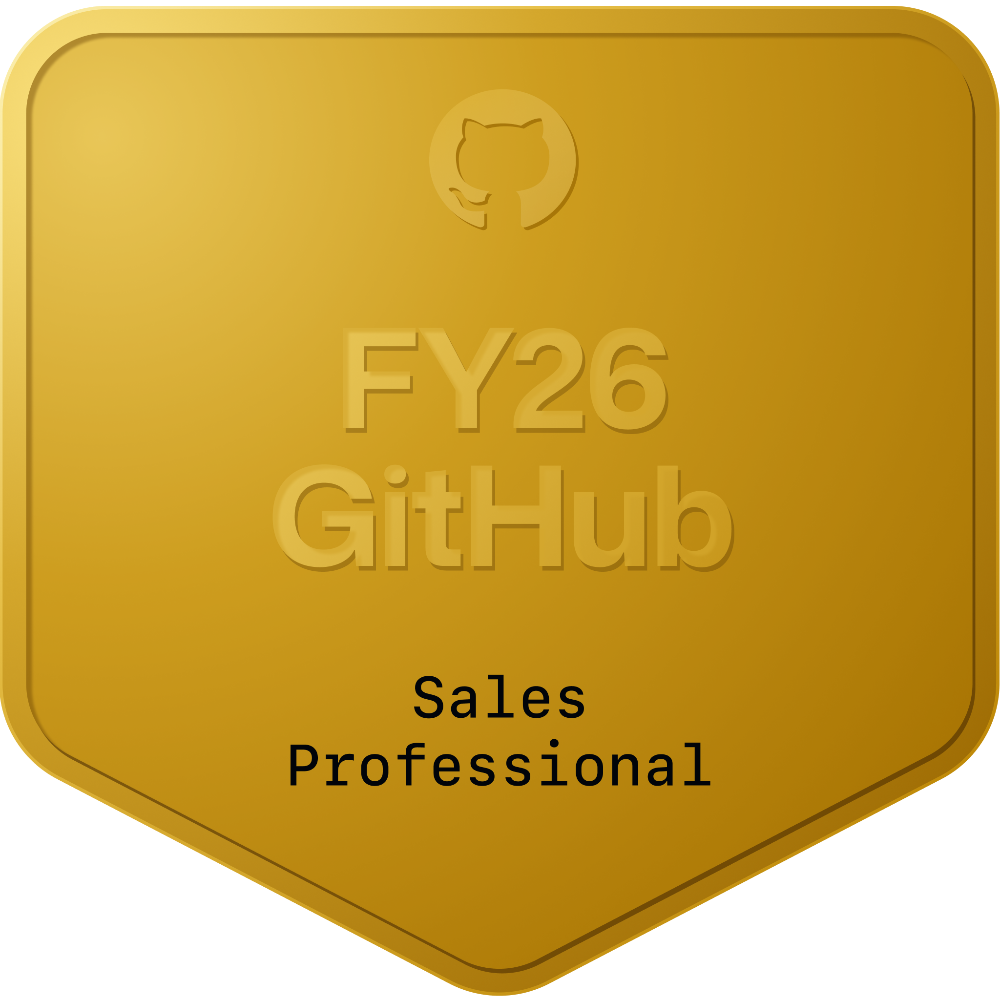
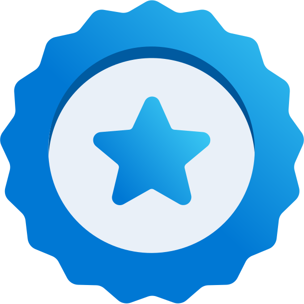

# 👋 Hi, I'm Raymond Splinter

## 🚀 About Me

**Consultant @ Xebia | DevOps Engineering | GitHub Copilot | Azure**

I am a consultant at [Xebia](https://www.xebia.com/) with a focus on DevOps and GitHub. With my experience in AI-powered engineering, I help organizations implement DevOps practices in Azure and GitHub, ranging from migrating applications to a secure Landing Zone to GitHub Copilot enablement.

I have a passion for AI-assisted development and helping developers become more effective.

### 🎯 Key Areas of Expertise

- GitHub Copilot
- CI/CD, GitHub Actions
- Infrastructure as Code
- Cloud Engineering (Azure, AWS)
- Software Development (C#, Java, Kotlin, Angular)

---

## 🏆 Certifications

### ☁️ Cloud Platforms

#### Microsoft Azure

  

- **Azure Fundamentals**

#### Amazon Web Services (AWS)

  
  
  
  
  

- **AWS Certified Developer – Associate**
- **AWS Certified Cloud Practitioner**
- AWS Well-Architected
- AWS Cloud Quest - Generative AI Architect
- AWS Knowledge - Serverless

### 🔧 DevOps

#### GitHub

  
  
  
  
  
  
  
  
  
  
  
  
  
  
  
  

- **GitHub Copilot**
- **GitHub Foundations**
- GitHub Migrations Delivery Credential
- AzureDevOps to GitHub Migrations Delivery Credential
- GitHub Advanced Security Delivery Credential
- GitHub Copilot: Core Skills & Application Delivery Credential
- GitHub Copilot: Scaling AI in the Enterprise Delivery Credential
- FY26 GitHub Sales Professional
- FY26 GitHub Platform Sales Badge
- FY26 GitHub Advanced Security Sales Badge
- FY26 GitHub Copilot Sales Badge
- FY26 GitHub Revenue Motions Sales Badge
- GitHub Tech Sales Professional
- Microsoft Applied Skills: Automate Azure Load Testing by using GitHub Actions
- Microsoft Applied Skills: Accelerate AI-assisted development by using GitHub Copilot
- Microsoft Applied Skills: Resolve Github issues by using GitHub Copilot

---

## 🎓 Education

- **Bachelor of Science, Software Engineering** (2018 - 2022) — Amsterdam University of Applied Sciences

---

## 💼 Experience Highlights

### Consultant - Xebia (2025 - Present)

Transforming Azure cloud architecture for enterprise clients, with a focus on AI-assisted development. This can be in the form of migrations to the Azure cloud, or supporting developers and organizations to embrace GitHub Copilot.

**Azure Cloud Migrations**
- Build secure cloud infrastructure in Landing Zones and apply DevOps best practices
- Migrate existing applications to the Azure Landing Zone
- Build CI/CD pipelines for smooth migration and long-term maintenance

**GitHub Copilot Enablement**
- Support teams in adopting GitHub Copilot
- Provide training to help developers get the most out of GitHub Copilot

### Software Engineer - Cognizant (2022 - 2025)

Developed applications in complex environments for organizations in the financial and racing industries.

- Develop applications with a focus on back-end development
- Deploy applications to Azure with CI/CD and Cloud Foundry

---

## 📫 How to Find Me

- 💼 LinkedIn: [raymond-splinter](https://www.linkedin.com/in/raymond-splinter/)
- 🏆 Credly: [raymond-splinter](https://www.credly.com/users/raymond-splinter/badges)
- 🐱 GitHub: [@RHSplinter](https://github.com/RHSplinter)

---

*Profile last updated: May 2026*